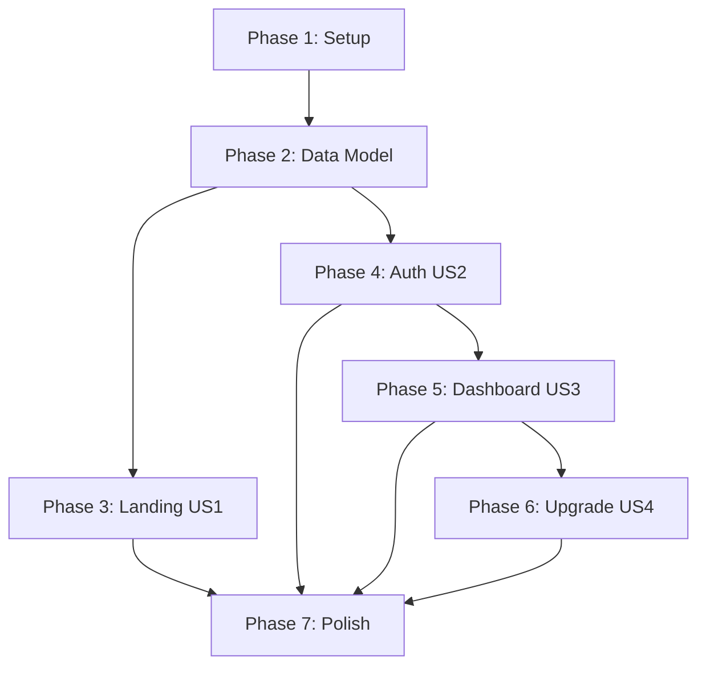

# Implementation Tasks: MVP Website

**Feature**: MVP Website (Landing, Dashboard, Auth)
**Branch**: `001-mvp-website`
**Generated**: 2025-10-22
**Status**: Ready for Implementation

## Task Format

Each task follows this format:
```
- [ ] [T###] [P?] [Story?] Description with file path
```

- **T###**: Sequential task ID
- **[P]**: Parallel execution marker (tasks that can run independently)
- **[US#]**: User Story reference (US1, US2, US3, US4)

## Implementation Phases

### Phase 1: Project Setup & Foundation

**Purpose**: Initialize Next.js project, configure tooling, set up database

- [ ] [T001] [P] Initialize Next.js 14 project with TypeScript and App Router → `/`
- [ ] [T002] [P] Configure TailwindCSS 3.x with dark mode support → `tailwind.config.ts`
- [ ] [T003] [P] Install and configure shadcn/ui components → `components.json`
- [ ] [T004] Set up PostgreSQL database (Docker Compose) → `docker-compose.yml`
- [ ] [T005] [P] Install Drizzle ORM and configure database client → `lib/db/index.ts`
- [ ] [T006] [P] Create environment variables template → `.env.local.example`
- [ ] [T007] [P] Configure ESLint, Prettier, and TypeScript strict mode → `tsconfig.json`, `.eslintrc.json`
- [ ] [T008] [P] Set up Vitest for unit testing → `vitest.config.ts`
- [ ] [T009] [P] Set up Playwright for E2E testing → `playwright.config.ts`
- [ ] [T010] Create Next.js route groups: (marketing), (auth), (dashboard) → `app/(marketing)`, `app/(auth)`, `app/(dashboard)`

**Checkpoint**: Project structure created, dependencies installed, database ready

---

### Phase 2: Data Model & Configuration

**Purpose**: Define database schema, create migrations, set up static configs

- [ ] [T011] Create Drizzle schema for users table → `lib/db/schema.ts`
- [ ] [T012] Create Drizzle schema for sessions table → `lib/db/schema.ts`
- [ ] [T013] Create Drizzle schema for usage_metrics table → `lib/db/schema.ts`
- [ ] [T014] Generate initial migration (users, sessions, usage_metrics) → `drizzle/0001_*.sql`
- [ ] [T015] Apply database migration to local PostgreSQL → run `npx drizzle-kit push:pg`
- [ ] [T016] [P] Create static config for plans (Free, Pro) → `config/plans.ts`
- [ ] [T017] [P] Create static config for data sources (4 sources) → `config/data-sources.ts`
- [ ] [T017a] Verify data-sources.ts matches FR-025 requirements (4 sources: Binance Prices, Crypto News, On-chain Metrics, Social Signals) → manual verification
- [ ] [T018] [P] Create Zod validation schemas (user, session, usageMetric) → `lib/validation.ts`
- [ ] [T019] [P] Create centralized site copy config → `config/site-copy.ts`

**Checkpoint**: Database schema created, migrations applied, static configs ready

---

### Phase 3: User Story 1 - Landing Page (Priority P1)

**Purpose**: Build public landing page with hero, value props, plans, FAQ

- [ ] [T020] [US1] Create landing page layout with dark theme → `app/(marketing)/page.tsx`
- [ ] [T021] [US1] Implement Hero section with tagline and CTAs → `components/landing/hero.tsx`
- [ ] [T022] [US1] [P] Implement Value Propositions section (3 cards) → `components/landing/value-props.tsx`
- [ ] [T023] [US1] [P] Implement How It Works section (3 steps) → `components/landing/how-it-works.tsx`
- [ ] [T024] [US1] [P] Implement Plans section (Free vs Pro comparison) → `components/landing/plans.tsx`
- [ ] [T025] [US1] [P] Implement FAQ section (4+ questions) → `components/landing/faq.tsx`
- [ ] [T026] [US1] [P] Implement Footer with links and copyright → `components/landing/footer.tsx`
- [ ] [T026a] [US1] [P] Create Privacy Policy static page → `app/(marketing)/privacy/page.tsx`
- [ ] [T026b] [US1] [P] Create Terms of Service static page → `app/(marketing)/terms/page.tsx`
- [ ] [T026c] [US1] [P] Create Status page placeholder → `app/(marketing)/status/page.tsx`
- [ ] [T027] [US1] Add SEO metadata (title, description, Open Graph) → `app/(marketing)/layout.tsx`
- [ ] [T028] [US1] Configure next-themes for dark mode provider → `components/theme-provider.tsx`
- [ ] [T029] [US1] Implement mobile-responsive layout (320px-2560px) → all landing components
- [ ] [T030] [US1] Add Lighthouse performance optimizations (target 90+) → optimize images, fonts, bundle
- [ ] [T031] [US1] Test landing page renders on mobile and desktop → Playwright test
- [ ] [T032] [US1] Verify all CTAs navigate correctly → Playwright test

**Checkpoint**: Landing page complete, responsive, SEO-optimized, performance target met

---

### Phase 4: User Story 2 - OAuth Authentication (Priority P1)

**Purpose**: Implement Auth.js with Google/GitHub OAuth, session management

- [ ] [T033] [US2] Install Auth.js v5 and dependencies → `package.json`
- [ ] [T034] [US2] Configure Auth.js with Google and GitHub providers → `lib/auth.ts`
- [ ] [T035] [US2] Set up Drizzle adapter for Auth.js → `lib/auth.ts`
- [ ] [T036] [US2] Create OAuth callback route handler → `app/api/auth/[...nextauth]/route.ts`
- [ ] [T037] [US2] Create signin page with provider buttons → `app/(auth)/auth/signin/page.tsx`
- [ ] [T038] [US2] Implement CSRF protection and state validation → `lib/auth.ts`
- [ ] [T039] [US2] Implement PKCE for authorization code flow → `lib/auth.ts`
- [ ] [T040] [US2] Configure session cookies (HttpOnly, Secure, SameSite=Lax) → `lib/auth.ts`
- [ ] [T041] [US2] Set session duration to 60 minutes with silent refresh → `lib/auth.ts`
- [ ] [T042] [US2] Create middleware for protected route authentication → `middleware.ts`
- [ ] [T043] [US2] Implement rate limiting (30/IP/hour, 15/user/hour) → `lib/rate-limit.ts`
- [ ] [T044] [US2] Add error handling for OAuth failures (denial, provider unavailable) → `app/(auth)/auth/signin/page.tsx`
- [ ] [T045] [US2] Implement signout functionality → `app/api/auth/signout/route.ts`
- [ ] [T046] [US2] Create Google OAuth credentials (development) → Google Cloud Console
- [ ] [T047] [US2] Create GitHub OAuth app (development) → GitHub Developer Settings
- [ ] [T048] [US2] Test OAuth flow with Google provider → Playwright test
- [ ] [T049] [US2] Test OAuth flow with GitHub provider → Playwright test
- [ ] [T050] [US2] Test session expiry after 60 minutes → Playwright test
- [ ] [T051] [US2] Test rate limiting enforcement (30 per IP/hour) → Playwright test
- [ ] [T051a] [US2] Test per-user rate limiting (15 per user/hour) → Playwright test
- [ ] [T052] [US2] Test protected route redirects for unauthenticated users → Playwright test

**Checkpoint**: OAuth authentication working, sessions managed, rate limits enforced

---

### Phase 5: User Story 3 - Dashboard (Priority P2)

**Purpose**: Build authenticated dashboard with plan info, usage stats, sources list

- [ ] [T053] [US3] Create dashboard layout with dark theme → `app/(dashboard)/dashboard/layout.tsx`
- [ ] [T054] [US3] Implement dashboard header with navigation → `components/dashboard/header.tsx`
- [ ] [T055] [US3] [P] Implement Plan panel (displays user's plan and usage) → `components/dashboard/plan-panel.tsx`
- [ ] [T056] [US3] [P] Implement Sources panel (lists data sources with availability) → `components/dashboard/sources-panel.tsx`
- [ ] [T057] [US3] Create API route for usage metrics → `app/api/dashboard/usage/route.ts`
- [ ] [T058] [US3] Create API route for data sources list → `app/api/dashboard/sources/route.ts`
- [ ] [T059] [US3] Implement usage tracking function (increment request count) → `lib/usage.ts`
- [ ] [T060] [US3] Add legal disclaimer to dashboard footer → `components/dashboard/footer.tsx`
- [ ] [T061] [US3] Show "Upgrade to Pro" CTA for Free users only → `components/dashboard/plan-panel.tsx`
- [ ] [T062] [US3] Display plan-based rate limits caption → `components/dashboard/plan-panel.tsx`
- [ ] [T063] [US3] Test dashboard displays correct plan for Free user → Playwright test
- [ ] [T064] [US3] Test dashboard displays correct plan for Pro user → Playwright test
- [ ] [T065] [US3] Test usage metrics API returns accurate data → Vitest test
- [ ] [T066] [US3] Test sources list shows correct availability per plan → Playwright test

**Checkpoint**: Dashboard functional, displays plan/usage/sources correctly per user tier

---

### Phase 6: User Story 4 - Plan Upgrade (Priority P3)

**Purpose**: Create upgrade journey UI (billing page placeholder for MVP)

- [ ] [T067] [US4] Create billing page layout → `app/(dashboard)/billing/page.tsx`
- [ ] [T068] [US4] Display Pro plan pricing and features → `components/billing/pro-plan-card.tsx`
- [ ] [T069] [US4] Add "Join waitlist" CTA (no payment processing) → `components/billing/waitlist-cta.tsx`
- [ ] [T070] [US4] Link "Upgrade to Pro" button to /billing → `components/dashboard/plan-panel.tsx`
- [ ] [T071] [US4] Test upgrade flow navigation (Free user clicks Upgrade) → Playwright test

**Checkpoint**: Upgrade journey UI complete, billing page displays Pro features

---

### Phase 7: Polish & Final Testing

**Purpose**: Cross-cutting concerns, performance, accessibility, edge cases

- [ ] [T072] Add 404 page with link back to landing/dashboard → `app/not-found.tsx`
- [ ] [T073] Add loading states for all async components → use React Suspense
- [ ] [T074] Implement error boundaries for graceful error handling → `app/error.tsx`
- [ ] [T075] Test mobile responsiveness (320px, 768px, 1024px, 1920px) → Playwright test
- [ ] [T076] Test dark theme consistency across all pages → Playwright test
- [ ] [T077] Run Lighthouse audit and optimize for 90+ score → fix issues
- [ ] [T078] Test landing page loads in <2s on 3G connection → Lighthouse test
- [ ] [T079] Test all edge cases: OAuth denial, provider unavailable, expired session → Playwright tests
- [ ] [T080] Verify CSRF protection is active → manual security test
- [ ] [T081] Verify session cookies have correct flags (HttpOnly, Secure, SameSite) → manual test
- [ ] [T082] Run full E2E test suite across all user stories → Playwright
- [ ] [T083] Generate test coverage report (target 80%+ for critical paths) → Vitest
- [ ] [T084] Review all copy against tone guidelines (concise, factual, no hype) → manual review
- [ ] [T085] Verify no financial advice claims in any copy → manual review
- [ ] [T086] Create quickstart.md setup guide → `/specs/001-mvp-website/quickstart.md` (already exists)
- [ ] [T087] Update README.md with project overview and setup instructions → `/README.md`

**Checkpoint**: All tests pass, performance targets met, documentation complete

---

## Dependency Graph



**Critical Path**: Setup → Data Model → Auth → Dashboard → Polish
**Parallel Opportunities**: Landing page (US1) can be built in parallel with Auth (US2) after Phase 2 completes

---

## Implementation Strategy

### Week 1: Foundation & Landing
- Days 1-2: Phase 1 (Project Setup) + Phase 2 (Data Model)
- Days 3-5: Phase 3 (Landing Page)

### Week 2: Authentication & Dashboard
- Days 1-3: Phase 4 (OAuth Authentication)
- Days 4-5: Phase 5 (Dashboard)

### Week 3: Upgrade Flow & Polish
- Day 1: Phase 6 (Plan Upgrade)
- Days 2-5: Phase 7 (Polish & Testing)

**Total Tasks**: 92 (T001-T087 + 5 additional tasks)
**Total Estimated Time**: 15 working days (3 weeks)

---

## Testing Checklist

### Unit Tests (Vitest)
- [ ] Validate user schema (email, provider, plan)
- [ ] Validate session schema (token, expiry)
- [ ] Validate usage metric schema (counts, quotas)
- [ ] Test usage tracking function (increment logic)
- [ ] Test rate limiting logic (30/IP, 15/user)
- [ ] Test API route handlers (usage, sources)

### E2E Tests (Playwright)
- [ ] Landing page loads with all sections
- [ ] OAuth signin with Google succeeds
- [ ] OAuth signin with GitHub succeeds
- [ ] Protected routes redirect unauthenticated users
- [ ] Dashboard displays correct plan/usage for Free user
- [ ] Dashboard displays correct plan/usage for Pro user
- [ ] Session expires after 60 minutes
- [ ] Rate limiting blocks excessive signin attempts
- [ ] Mobile responsive layout works (320px-2560px)
- [ ] Dark theme applies consistently

### Performance Tests
- [ ] Lighthouse score 90+ (mobile)
- [ ] Lighthouse score 90+ (desktop)
- [ ] Landing page loads in <2s on 3G
- [ ] Dashboard loads in <1s on fast connection

### Security Tests
- [ ] CSRF protection active on OAuth flow
- [ ] Session cookies have HttpOnly, Secure, SameSite flags
- [ ] Protected endpoints return 401 for unauthenticated requests
- [ ] Rate limiting prevents brute-force signin attempts

---

## Success Metrics

- **SC-001**: Landing page communicates value prop in <10 seconds ✅
- **SC-002**: OAuth signin completes in <30 seconds ✅
- **SC-003**: Lighthouse score 90+ on mobile/desktop ✅
- **SC-004**: Landing loads in <2s on 3G ✅
- **SC-005**: 95%+ OAuth signin success rate ✅
- **SC-006**: 100% accurate plan/usage display ✅
- **SC-007**: Responsive design 320px-1920px ✅
- **SC-008**: Zero auth bypasses (401 enforcement) ✅
- **SC-009**: Rate limiting active (30/IP, 15/user) ✅
- **SC-010**: 60-minute session duration ✅

---

## Notes

- **Parallel Execution**: Tasks marked [P] can be executed in parallel with other [P] tasks in the same phase
- **User Story Labels**: [US1], [US2], [US3], [US4] map to the 4 user stories for traceability
- **Testing**: Each phase includes tests; final Phase 7 runs comprehensive E2E suite
- **Constitution Compliance**: All tasks align with 7 core principles (verified in plan.md)
- **MVP Scope**: Payment processing, email features, and advanced analytics are post-MVP
- **Additional Tasks**: T017a (data sources validation), T026a-c (Privacy/Terms/Status pages), T051a (per-user rate limit test) added via /speckit.analyze remediation

---

**Ready to begin implementation. Start with Phase 1: Project Setup.**
